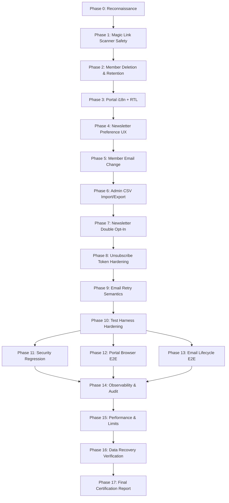

# Vibress — Members, Portal & Email Lists
# Production Hardening & Certification Implementation Plan (Amended)

**Authoritative Baseline**:
- Audit Report: [VIBRESS_MEMBERS_PORTAL_EMAIL_LISTS_PRODUCTION_AUDIT.md](file:///Users/abdullahzaher/vibress/VIBRESS_MEMBERS_PORTAL_EMAIL_LISTS_PRODUCTION_AUDIT.md)
- Baseline Git SHA: `df1348a855fc8b90d8877586c4c3bc1379c5f9cb`
- Target Branch: `main`

---

## Executive Overview & Objectives

This implementation plan defines the complete engineering roadmap to resolve all findings from the production audit and elevate the **Members**, **Portal**, and **Email Lists** subsystems of Vibress to verified **PRODUCTION READY** status.

### Summary of Amendments & Key Technical Specifications:
1. **Magic Link Scanner Safety (P1-MEM-01)**: `GET /api/members/v1/auth/verify` is made strictly non-mutating (safe redirect/status). Token consumption and session issuance occur exclusively via `POST /api/members/v1/auth/verify` invoked by the client-side `VerifyPage.tsx`.
2. **Member Account Deletion & Retention Matrix (P1-MEM-02)**: Formal technical data retention matrix defined in [VIBRESS_MEMBER_DATA_RETENTION_MATRIX.md](file:///Users/abdullahzaher/vibress/VIBRESS_MEMBER_DATA_RETENTION_MATRIX.md). Cascading deletion removes sessions, tokens, notifications, preferences, and anonymizes/detaches historical records.
3. **Portal Localization with `@vibress/i18n` (P1-POR-01)**: Integration of existing `@vibress/i18n` with Portal SPA, supporting English LTR and Arabic RTL, locale detection, language switching, and CSS logical properties.
4. **Newsletter Preferences Join (P2-POR-02)**: `GET /api/members/v1/newsletter-preferences` returns rich metadata (`name`, `description`, `key`), eliminating raw UUID prefixes in Portal UI.
5. **Verified Member Email Change (P2-MEM-01)**: Cryptographic verification token sent to new address, old address notification, and publication-scoped collision checks.
6. **Admin Member CSV Tooling (P2-MEM-02)**: Streaming export with CSV formula injection protection (`=`, `+`, `-`, `@` escaping), batch import with dry-run support and structured reporting.
7. **Newsletter Double Opt-In Lifecycle (P2-EML-01)**: Explicit subscription states (`pending` -> `confirmed` / `unsubscribed`) with HMAC tokens and confirmation endpoints.
8. **Unsubscribe Token Hardening (P3-EML-02)**: Timestamp embedding and expiry verification with legacy format backward compatibility.
9. **Email Retry Hardening (P3-EML-01)**: Bounded retry logic for eligible transient delivery failures.
10. **Test Harness & E2E Hardening (P2-TST-01)**: Deterministic fixture cleanup and Playwright browser regression suites.

---

## Phase Breakdown & Architecture Execution Plan

---

### Phase 0: Reconnaissance & Workspace Verification
- Verify clean git status on `main` at `df1348a855fc8b90d8877586c4c3bc1379c5f9cb`.
- Inspect existing member and newsletter repositories, API routes, portal components, and worker queues.

### Phase 1: Magic Link Scanner Safety (P1-MEM-01)
- **Target Files**:
  - `packages/domains/members/src/application/member-auth-service.ts`
  - `apps/api/src/routes/members.ts`
  - `apps/portal/src/pages/VerifyPage.tsx`
- **Specification**:
  - Magic links point to `${portalUrl}/portal/#/auth/verify?token=${token}`.
  - `GET /api/members/v1/auth/verify` is made non-mutating: redirects to Portal URL or returns `{ status: "pending", verifyUrl: "..." }`.
  - `POST /api/members/v1/auth/verify` performs atomic token consumption, email verification, and session cookie generation.
  - Unit & API regression tests in `apps/api/src/__tests__/member-magic-link-scanner.test.ts`.

### Phase 2: Member Account Deletion + Data Retention (P1-MEM-02)
- **Target Files**:
  - `VIBRESS_MEMBER_DATA_RETENTION_MATRIX.md` (Design doc)
  - `packages/domains/members/src/application/members-service.ts`
  - `packages/domains/members/src/infrastructure/drizzle-member-repository.ts`
  - `apps/api/src/routes/members.ts` (`DELETE /api/members/v1/me`)
  - `apps/api/src/routes/admin-members.ts` (`DELETE /api/admin/v1/members/:id`)
  - `apps/portal/src/pages/AccountPage.tsx` (Delete Account Modal)
  - `apps/portal/src/lib/member-api.ts`
- **Specification**:
  - Atomic transactional deletion: revokes sessions, deletes auth tokens, removes newsletter preferences, clears member notifications, cancels subscriptions, and deletes/anonymizes member record.
  - Emits `member.deleted` domain event.
  - Tests in `apps/api/src/__tests__/member-deletion.test.ts`.

### Phase 3: Portal Internationalization (i18n) & RTL Layout (P1-POR-01)
- **Target Files**:
  - `apps/portal/package.json` (add `@vibress/i18n`)
  - `apps/portal/src/lib/i18n.tsx` (Portal I18n Context & `useTranslation()` hook)
  - `apps/portal/src/pages/*` and `apps/portal/src/components/*`
- **Specification**:
  - Complete English and Arabic dictionaries for all portal views.
  - Dynamic `document.documentElement.lang` and `document.documentElement.dir` (`rtl` / `ltr`).
  - CSS logical properties (`margin-inline`, `padding-inline`, `text-align: start`).

### Phase 4: Newsletter Preference UX & Metadata Join (P2-POR-02)
- **Target Files**:
  - `packages/domains/newsletters/src/domain/newsletter.ts`
  - `packages/domains/newsletters/src/infrastructure/drizzle-newsletter-repositories.ts`
  - `apps/api/src/routes/member-newsletters.ts`
  - `apps/portal/src/components/NewsletterPreferencesSection.tsx`
- **Specification**:
  - Join `newsletters` table in `listPreferencesForMember` to return `{ newsletterId, key, name, description, subscribed }`.
  - Display human-readable title and description in Portal UI instead of raw UUID slice.

### Phase 5: Verified Member Email Change (P2-MEM-01)
- **Target Files**:
  - `packages/domains/members/src/application/members-service.ts`
  - `apps/api/src/routes/members.ts`
  - `apps/portal/src/pages/AccountPage.tsx`
- **Specification**:
  - `POST /api/members/v1/auth/request-email-change`: validates format, publication uniqueness, creates token `change_email:<email>`, sends email to new address and notice to old address.
  - `POST /api/members/v1/auth/confirm-email-change`: validates token, updates email atomically, emits `member.email_changed`.

### Phase 6: Admin Member CSV Import & Export (P2-MEM-02)
- **Target Files**:
  - `apps/api/src/routes/admin-members.ts`
  - `packages/domains/members/src/application/members-service.ts`
- **Specification**:
  - `GET /api/admin/v1/members/export`: UTF-8 streaming CSV with spreadsheet formula injection sanitization (`=`, `+`, `-`, `@` escaping).
  - `POST /api/admin/v1/members/import`: Batch import with dry-run mode (`?dryRun=true`), email normalization, validation, and structured summary reporting.

### Phase 7: Newsletter Double Opt-In Subscriptions (P2-EML-01)
- **Target Files**:
  - `packages/domains/newsletters/src/application/newsletters-service.ts`
  - `apps/api/src/routes/member-newsletters.ts`
- **Specification**:
  - Cryptographic HMAC-SHA256 confirmation token bound to `memberId:newsletterId:timestamp`.
  - Public confirmation endpoint `POST /api/public/v1/newsletters/confirm`.
  - Transition state to confirmed upon token redemption.

### Phase 8: Unsubscribe Token Hardening (P3-EML-02)
- **Target Files**:
  - `packages/domains/newsletters/src/application/newsletters-service.ts`
- **Specification**:
  - Embed timestamp into unsubscribe payload (`memberId:sendId:timestamp`).
  - Validate token freshness against `UNSUBSCRIBE_MAX_AGE_MS` while preserving legacy token compatibility.

### Phase 9: Email Retry Semantics Hardening (P3-EML-01)
- **Target Files**:
  - `packages/domains/email/src/application/email-service.ts`
  - `apps/worker/src/processors/email-delivery-worker.ts`
- **Specification**:
  - Implement bounded retry in `EmailService.retryFailedRecipients` for transient failures respecting suppression checks and max attempts.

### Phase 10: Test Harness Determinism (P2-TST-01)
- **Target Files**:
  - `packages/domains/members/src/__tests__/members-isolation.test.ts`
- **Specification**:
  - Add `beforeEach` publication cleanup and dynamic timestamped email fixtures to guarantee multi-run determinism.

### Phases 11–17: Full Regression, E2E, Observability & Final Certification
- Execute adversarial security tests (IDOR, CSRF, RBAC, tenant isolation).
- Execute Playwright browser E2E tests (`tests/e2e/member-portal-flow.test.ts`).
- Measure performance and audit events.
- Generate authoritative final certification report: `VIBRESS_MEMBERS_PORTAL_EMAIL_LISTS_FINAL_PRODUCTION_CERTIFICATION.md`.
