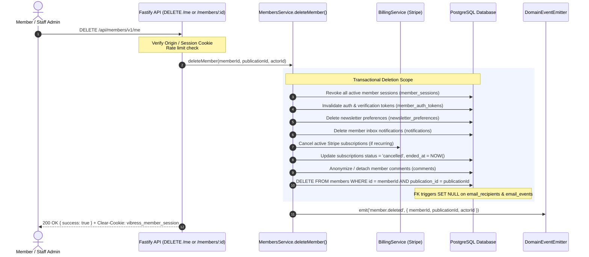

# Vibress — Member Data Retention & Deletion Matrix

**Document Purpose**: Defines the authoritative technical data lifecycle, deletion semantics, anonymization procedures, and retention policies for member-linked records across the Vibress multi-tenant publication platform.

---

## 1. Data Classification & Deletion Matrix

| Entity / Table | Primary Identifier | Policy on Member Deletion | Technical Mechanism | Rationale & Legal/Operational Context |
| :--- | :--- | :--- | :--- | :--- |
| **`members`** | `id` (UUID) | **DELETE / PURGE** | `DELETE FROM members WHERE id = :memberId` | Eliminates primary PII (`email`, `email_normalized`, `name`) satisfying GDPR Right to Erasure / RTBF. |
| **`member_sessions`** | `id` (UUID) | **DELETE & REVOKE** | FK `ON DELETE CASCADE` | Immediate termination of all active sessions across all devices. |
| **`member_auth_tokens`**| `id` (UUID) | **DELETE & PURGE** | FK `ON DELETE CASCADE` | Invalidates any in-flight magic links or email change verification tokens. |
| **`newsletter_preferences`** | `id` (UUID) | **DELETE & PURGE** | FK `ON DELETE CASCADE` | Halts all future newsletter broadcasts and removes member subscription records. |
| **`notifications`** | `id` (UUID) | **DELETE & PURGE** | `DELETE FROM notifications WHERE recipient_id = :memberId` | Purges member-private notification inbox and in-app alerts. |
| **`billing_customers`**| `id` (UUID) | **ANONYMIZE / DETACH** | Clear `member_id` or mark `status = 'deleted'` in Stripe | Preserves payment gateway mapping for dispute resolution and tax compliance while severing member link. |
| **`subscriptions`** | `id` (UUID) | **CANCEL & RETAIN** | Update `status = 'cancelled'`, cancel in Stripe | Financial accounting standards require retaining subscription transaction history. |
| **`email_recipients`** | `id` (UUID) | **DETACH (SET NULL)** | FK `ON DELETE SET NULL` (`member_id = NULL`) | Preserves campaign aggregate deliverability statistics (sent count, bounce rate) while removing member PII linkage. |
| **`email_events`** | `id` (UUID) | **DETACH (SET NULL)** | FK `ON DELETE SET NULL` (`member_id = NULL`) | Retains delivery and engagement telemetry for deliverability diagnostics without identifying the individual reader. |
| **`email_suppressions`**| `id` (UUID) | **RETAIN EMAIL ONLY** | FK `ON DELETE CASCADE` on `member_id`, keep `email` | Retains email hash/string in suppression list to prevent re-sending to hard-bounced or complaining addresses. |
| **`comments`** | `id` (UUID) | **ANONYMIZE / SOFT-DELETE** | Set `body = '[Deleted Member]'`, `deleted_at = NOW()` | Prevents broken comment hierarchy / orphaned reply threads while removing author identity. |
| **`domain_events` / Audit**| `id` (UUID) | **RETAIN (NO PII)** | Log `event = 'member.deleted'`, actor ID, timestamp | Preserves compliance audit trail without logging raw emails, tokens, or names. |

---

## 2. Technical Execution Workflow for Member Deletion

---

## 3. Post-Deletion Verification Checklist

1. Active session cookie is cleared on client; subsequent requests return `401 Unauthorized`.
2. Existing magic links or email change verification tokens return `AUTH_TOKEN_INVALID` or `MEMBER_NOT_FOUND`.
3. Member does not appear in `GET /api/admin/v1/members` or member search.
4. Member email can be re-registered as a fresh member in the future without conflict (`uniqueIndex` on `publication_id, email_normalized` allows re-creation after deletion).
5. Newsletter broadcasts no longer include the deleted member in calculated recipient audiences.
