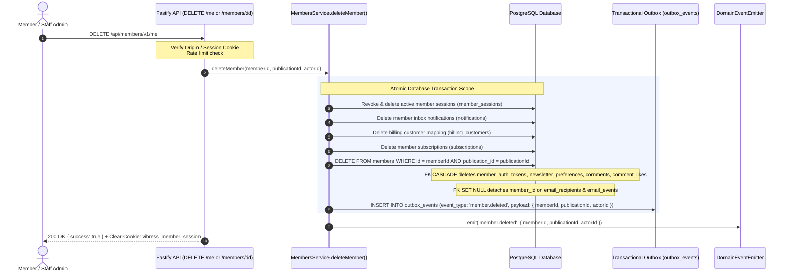

# Vibress — Member Data Retention & Deletion Matrix

**Document Purpose**: Defines the authoritative technical data lifecycle, deletion semantics, anonymization procedures, and retention policies for member-linked records across the Vibress multi-tenant publication platform.

---

## 1. Data Classification & Deletion Matrix

| Entity / Table | Primary Identifier | Policy on Member Deletion | Technical Mechanism | Rationale & Legal/Operational Context |
| :--- | :--- | :--- | :--- | :--- |
| **`members`** | `id` (UUID) | **DELETE / PURGE** | `DELETE FROM members WHERE id = :memberId` | Eliminates primary PII (`email`, `email_normalized`, `name`) satisfying GDPR Right to Erasure / RTBF. |
| **`member_sessions`** | `id` (UUID) | **DELETE & REVOKE** | FK `ON DELETE CASCADE` & explicit `sessionRepo.revokeAllForMember` | Immediate termination of all active sessions across all devices. |
| **`member_auth_tokens`**| `id` (UUID) | **DELETE & PURGE** | FK `ON DELETE CASCADE` | Invalidates any in-flight magic links or email change verification tokens. |
| **`newsletter_preferences`** | `id` (UUID) | **DELETE & PURGE** | FK `ON DELETE CASCADE` | Halts all future newsletter broadcasts and removes member subscription records. |
| **`notifications`** | `id` (UUID) | **DELETE & PURGE** | `DELETE FROM notifications WHERE recipient_id = :memberId` | Purges member-private notification inbox and in-app alerts. |
| **`billing_customers`**| `id` (UUID) | **DELETE / PURGE** | `DELETE FROM billing_customers WHERE member_id = :memberId` | Purges customer mapping rows prior to member deletion to satisfy FK restrictions. |
| **`subscriptions`** | `id` (UUID) | **DELETE / PURGE** | `DELETE FROM subscriptions WHERE member_id = :memberId` | Purges local member subscription rows prior to member deletion to satisfy FK restrictions. |
| **`comments`** | `id` (UUID) | **DELETE & PURGE (CASCADE)** | FK `ON DELETE CASCADE` | Full erasure of member commentary and associated records upon member account deletion. |
| **`comment_likes`** | `id` (UUID) | **DELETE & PURGE (CASCADE)** | FK `ON DELETE CASCADE` | Purges all like interactions by the deleted member. |
| **`comment_reports`** | `id` (UUID) | **DELETE & PURGE (CASCADE)** | FK `ON DELETE CASCADE` | Purges user-submitted report records. |
| **`email_recipients`** | `id` (UUID) | **DETACH (SET NULL)** | FK `ON DELETE SET NULL` (`member_id = NULL`) | Preserves campaign aggregate deliverability statistics (sent count, bounce rate) while removing member PII linkage. |
| **`email_events`** | `id` (UUID) | **DETACH (SET NULL)** | FK `ON DELETE SET NULL` (`member_id = NULL`) | Retains delivery and engagement telemetry for deliverability diagnostics without identifying the individual reader. |
| **`email_suppressions`**| `id` (UUID) | **RETAIN EMAIL STRING / PURGE MEMBER_ID** | `email` text retained; FK `ON DELETE CASCADE` on `member_id` | Retains raw email string in suppression list to prevent re-sending to hard-bounced or complaining addresses. `member_id` reference is removed upon member deletion. |
| **`outbox_events`** | `id` (UUID) | **TRANSACTIONAL PERSISTENCE (NO PII)** | `INSERT INTO outbox_events` (`eventType = 'member.deleted'`) | Persists durable downstream synchronization event with non-PII payload `{ memberId, publicationId, actorId }`. |
| **`domain_events` / Audit**| `id` (UUID) | **RETAIN (NO PII)** | Log `event = 'member.deleted'`, actor ID, timestamp | Preserves compliance audit trail without logging raw emails, tokens, or names. |

---

## 2. Technical Execution Workflow for Member Deletion

---

## 3. Post-Deletion Verification Checklist

1. Active session cookie is cleared on client; subsequent requests return `401 Unauthorized`.
2. Existing magic links or email change verification tokens return `AUTH_TOKEN_INVALID` or `MEMBER_NOT_FOUND`.
3. Member does not appear in `GET /api/admin/v1/members` or member search.
4. Member email can be re-registered as a fresh member in the future without conflict (`uniqueIndex` on `publication_id, email_normalized` allows re-creation after deletion).
5. Newsletter broadcasts no longer include the deleted member in calculated recipient audiences.
6. `outbox_events` table contains the durable `member.deleted` event with no raw PII.
