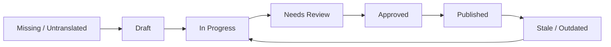

# Vibress Translation Management & Editorial Workflow — Staff Handbook

## 1. Introduction

Welcome to the Vibress Translation Management system. This guide provides step-by-step instructions for writers, translators, and editors on managing multilingual content across all active publication locales.

---

## 2. Translation Statuses & Lifecycle

Every translated item in Vibress progresses through an editorial workflow with distinct database statuses:

- ⚪ **Missing (Untranslated):** Content is published in the default locale, but no translation record exists yet for the target locale.
- 🔘 **Draft:** Translation record created, work in progress by translator/author.
- 🟣 **In Progress:** Actively being translated or revised.
- 🟡 **Needs Review:** Translation submitted by an author or generated by AI, awaiting editorial sign-off.
- 🔵 **Approved:** Editor reviewed and verified linguistic quality.
- 🟢 **Published:** Live and accessible at `https://yourpublication.com/:locale/:slug`.
- 🔴 **Stale (Outdated):** The source post or page was modified after the translation date. The translation is live but requires updating to match source revisions.

---

## 3. Translation Matrix (`/admin/translations`)

The Translation Matrix provides a central cockpit for your publication's multilingual health:

1. **Health Metrics Bar:** Displays total source content count, publication coverage percentage, stale count, and items awaiting review.
2. **Search & Filter:** Filter by content title, slug, content type (Posts/Pages), locale, or status.
3. **Locale Columns:** View translation statuses across all enabled languages (e.g. `English`, `العربية`, `Français`, `فارسی`).
4. **Field-Level Diff Notifications:** Easily identify when source modifications affect specific fields (e.g. Title, Excerpt, Body, Meta Tags).
5. **Status Badges:** Click any badge to open the Side-by-Side Workspace directly.

---

## 4. Side-by-Side Translation Workspace

When translating or editing a translation, the workspace presents a split view:

- **Left Pane (Source):** Displays original title, slug, excerpt, and content body with word counts in read-only mode.
- **Right Pane (Translation):** Editable fields formatted with the target language's writing direction (e.g., right-to-left for Arabic and Persian).
- **Field-Level Stale Alert & Diff:** If the source article was updated after the translation was created, an alert banner displays the exact changed fields (`TITLE`, `BODY`, `EXCERPT`, etc.) with a toggleable source diff viewer.
- **AI Translation Assistant & Publication Glossary:** Choose an AI provider (OpenAI, Anthropic, Gemini, or Auto) and click **"Translate Draft"**. Vibress automatically enforces the publication's official terminology glossary and generates a draft in `Needs Review` status.
- **Action Buttons:**
  - **Save Draft:** Saves your current work without notifying editors.
  - **Submit for Review:** Moves the translation into `Needs Review` for editorial approval.
  - **Approve:** Editorial sign-off.
  - **Publish Translation:** Deploys the translation live to the localized website.

---

## 5. Editorial Review Queue (`/admin/translations/queue`)

The review queue categorizes work into 3 priority tabs:

1. 🔴 **Stale Translations:** Live articles whose English source was modified. Update and republish these first to avoid outdated information.
2. 🟡 **Needs Review:** AI drafts and submitted translations waiting for editor sign-off.
3. 🔵 **Untranslated (Missing):** High-priority published English content missing translations.

---

## 6. Publication Terminology Glossaries

Vibress maintains a publication-wide translation glossary (e.g., `Vibress` ➔ `فايبرس`, `Workspace` ➔ `مساحة العمل`). When using AI translation or automated drafts, the system automatically injects these terms to ensure brand voice and terminology consistency across all articles.
