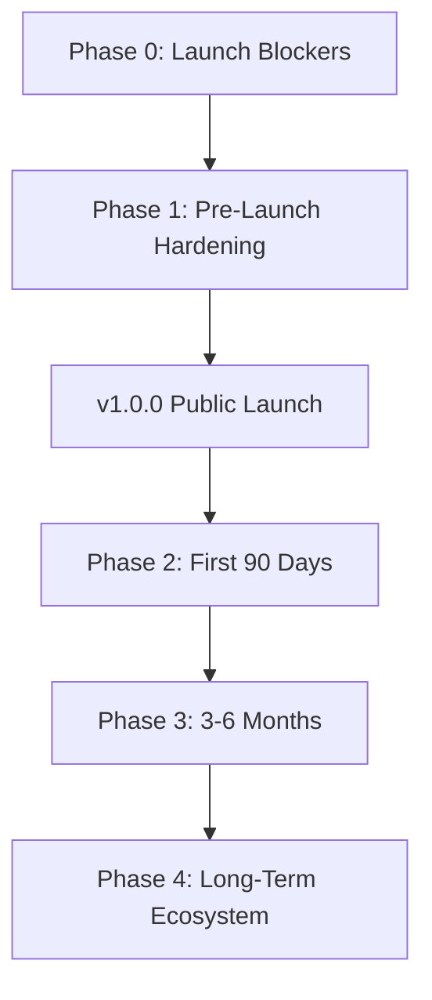

# Vibress — Production Roadmap & Completion Strategy

> **Audit Date**: 2026-09-13  
> **Auditor**: Independent Senior Engineering Audit Team  
> **Target**: Public Production Release (v1.0.0) $\to$ Scaled Enterprise Ecosystem (v2.0.0)

---

## 1. Roadmap Philosophy & Sequencing Rules

To transform Vibress into a secure, competitive, and reliable production platform, engineering priorities must strictly follow this sequencing:

1. **Security & Onboarding First**: Fix privilege escalation and broken staff onboarding before any new features.
2. **Editorial Stability**: Eliminate Studio runtime errors and ensure reliable autosave/crash recovery.
3. **Multi-Tenancy Honesty**: Either complete database/API query scoping or explicitly launch v1.0 as a hardened single-publication platform.
4. **Performance & Observability**: Add GIN indexes and application caching before scaling traffic.
5. **No Premature Ecosystem Work**: Delay complex plugin marketplaces and CRDT real-time collaboration until core editorial and enterprise workflows are rock-solid.

---

## 2. Phased Implementation Roadmap



---

### Phase 0 — Critical Launch Blockers (P0)
*Target: Immediate (Week 1–2)*  
*Objective: Eliminate critical security vulnerabilities, auth lockout risks, and studio crashes.*

| Task ID | Item & Action | Area | Complexity | Dependencies |
| :--- | :--- | :--- | :---: | :--- |
| **P0-1** | **Fix RBAC Wildcard Permissions in Seed Data**<br>Replace `posts.*` and `pages.*` wildcard assignments in `packages/database/src/seed.ts` for `author` and `contributor` roles with explicit permissions (`posts.create`, `posts.edit.own`, `posts.read`). | Security | Low (1-2 days) | None |
| **P0-2** | **Enforce Author Ownership in Posts/Pages Service**<br>Add ownership verification guard (`canModifyPost(userId, post)`) in `packages/domains/posts/src/application/posts-service.ts` to prevent authors from editing or deleting other users' posts. | Security | Medium (2-3 days) | P0-1 |
| **P0-3** | **Implement Functional Staff User Invitation Flow**<br>Update `POST /api/admin/v1/users/invite` to generate an invitation crypto token, persist in `user_invitations`, send transactional email with activation link, and provide `POST /api/auth/invitation/accept` endpoint. | Auth | Medium (3-4 days) | `@vibress/email` |
| **P0-4** | **Implement Staff Password Reset Endpoints**<br>Implement `POST /api/auth/forgot-password` and `POST /api/auth/reset-password` with expiring single-use tokens and brute-force rate-limiting. | Auth | Medium (2-3 days) | `@vibress/email` |
| **P0-5** | **Fix Lexical Studio Gutter Callback Runtime Error**<br>Wrap editor active state checks in `BlockHandleGutterPlugin.tsx:106:18` to prevent unhandled exceptions during block hover. | Studio | Low (1 day) | `@vibress/studio-react` |

---

### Phase 1 — Pre-Launch Hardening & Verification (P1)
*Target: Weeks 3–4 (Before Public Launch)*  
*Objective: Complete multi-tenancy scoping decisions, fix test harness flaws, and optimize database indexing.*

| Task ID | Item & Action | Area | Complexity | Dependencies |
| :--- | :--- | :--- | :---: | :--- |
| **P1-1** | **Multi-Tenancy Scope Alignment**<br>Either (A) add `publication_id` column to `posts`, `pages`, `media`, `tags`, and `settings` with API middleware scoping, or (B) officially document v1.0 as single-publication and guard workspace tables behind feature flag. | Architecture | High (1-2 weeks) | Migrations |
| **P1-2** | **Fix Visual Regression Test Comparator**<br>Refactor `tests/e2e/visual/multilingual-visual-regression.test.ts` to use true pixel bitmap diffing (Pixelmatch / Playwright `toHaveScreenshot()`) instead of file buffer byte length comparisons. | QA / Testing | Low (2 days) | Playwright |
| **P1-3** | **PostgreSQL Search GIN Trigram Index**<br>Add migration creating `gin_trgm_ops` index on `search_documents (title, body_text)` to ensure sub-millisecond search performance under load. | Database | Low (1 day) | PostgreSQL `pg_trgm` |
| **P1-4** | **Resolve Node pg Concurrency Warnings**<br>Fix background worker database connection checkout to prevent concurrent query execution on a single client connection. | Worker | Low (2 days) | Drizzle / pg |
| **P1-5** | **Production CSP & Security Headers**<br>Configure strict Content Security Policy headers with nonces in Fastify API and Next.js web application. | Security | Medium (2-3 days) | Fastify Helmet |

---

### Phase 2 — First 90 Days Post-Launch (P2)
*Target: Months 2–3*  
*Objective: Scale performance, enhance editorial workflows, and expand monetization.*

| Task ID | Item & Action | Area | Complexity | Dependencies |
| :--- | :--- | :--- | :---: | :--- |
| **P2-1** | **Cache-Aside Application Query Layer**<br>Implement Redis-backed cache layer for Next.js SSR post/page/setting queries with outbox-driven cache tag invalidation. | Performance | Medium (1 week) | `@vibress/cache` |
| **P2-2** | **Lexical Dynamic Custom Fields Form Renderer**<br>Build a dynamic sidebar in `@vibress/studio-react` that renders custom schema fields from `@vibress/content-modeler` (dates, prices, select boxes). | Studio | Medium (1-2 weeks) | `@vibress/content-modeler` |
| **P2-3** | **OpenTelemetry Distributed Tracing**<br>Add OpenTelemetry tracing to Fastify API, Next.js, and BullMQ worker for end-to-end request latency profiling. | Ops | Medium (1 week) | OTel SDK |
| **P2-4** | **Automated On-the-Fly Image Optimization**<br>Integrate Sharp / Libvips image processing pipeline in media service to automatically serve WebP/AVIF variants with responsive `srcset`. | Media | Medium (1 week) | `@vibress/media` |
| **P2-5** | **Bulk Translation Queue UI Actions**<br>Add multi-select bulk translation dispatch and bulk approval workflows in the Admin Translation Matrix. | i18n | Low (3 days) | `@vibress/translations` |

---

### Phase 3 — Strategic Expansion (3–6 Months)
*Target: Months 4–6*  
*Objective: Real-time collaboration, member community features, and analytics.*

| Task ID | Item & Action | Area | Complexity | Dependencies |
| :--- | :--- | :--- | :---: | :--- |
| **P3-1** | **CRDT Real-Time Collaborative Editing**<br>Integrate Yjs / Lexical Yjs provider with WebSocket presence gateway for Google Docs-style simultaneous editing. | Studio | High (3-4 weeks) | `@vibress/collaboration` |
| **P3-2** | **Privacy-Focused First-Party Analytics**<br>Expand event ingestion pipeline with real-time dashboards for reader scroll depth, referrer attribution, and newsletter conversion. | Analytics | High (2-3 weeks) | PostgreSQL / ClickHouse |
| **P3-3** | **Third-Party Sandboxed Plugin Runtime**<br>Implement secure WASM / isolated V8 worker execution for community-submitted plugins with capability-based security. | Extensibility | Very High (4-6 weeks) | `@vibress/plugin-sdk` |
| **P3-4** | **Public Theme Marketplace & CLI Sync**<br>Launch web-based theme directory and dynamic hot-reloading theme development CLI tool. | Themes | Medium (2 weeks) | Theme Engine |

---

## 3. The Mandatory "DO NOT BUILD YET" List

To maintain engineering velocity and avoid catastrophic scope creep, the following initiatives **MUST NOT be built until Phase 0, 1, and 2 are fully completed**:

```
❌ DO NOT BUILD YET LIST:
1. DO NOT build a public third-party plugin store/marketplace before the runtime WASM sandbox and capability security boundaries are architected.
2. DO NOT build multi-region database replication before single-cluster Redis caching and GIN indexing are proven in production.
3. DO NOT build complex CRDT multi-cursor collaborative editing before single-user autosave, crash recovery, and ownership permissions are 100% bug-free.
4. DO NOT build automated RAG fine-tuning AI pipelines before per-user token cost budgeting and rate-limiting safeguards are implemented.
5. DO NOT build custom mobile iOS/Android native apps before the responsive mobile web and Admin PWA experiences are polished.
```

---

## 4. Completion Effort & Milestone Summary

```
Total Roadmap Effort Estimate:
- Phase 0 (Launch Blockers):     2 Engineering Weeks (High Urgency)
- Phase 1 (Pre-Launch Hardening): 2 Engineering Weeks (Medium Urgency)
- Phase 2 (First 90 Days):        6 Engineering Weeks (High Value)
- Phase 3 (3–6 Months):          10 Engineering Weeks (Strategic)

Overall Readiness Milestone:
Current Readiness Score:         6.8 / 10 (Functional Beta)
Post Phase 0 & 1 Score:          8.5 / 10 (Strong Production Platform)
Post Phase 2 & 3 Score:          9.4 / 10 (Mature Market Leader)
```
