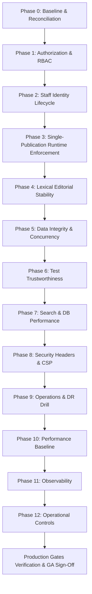

# Vibress — Master Production Remediation Implementation Plan

> **Document Version**: `v2.6.0 — Final Execution-Ready Correction`  
> **Audit Date**: 2026-09-13  
> **Auditor / Lead Architect**: Senior Engineering Agent Team  
> **Repository Baseline**: Clean Monorepo Workspace (Post-Migration `0024_multilingual_publications_translations`)  
> **Target Release Gate**: Vibress Production Hardening Release (`v1.0.0-GA`)  
> **Execution Standard**: Strict, Evidence-Backed, Zero-Speculation Implementation Specification  
> **Status Taxonomy**: `[VERIFIED]`, `[INFERRED]`, `[PROPOSED]`, `[UNKNOWN]`, `[PRODUCT DECISION REQUIRED]`

---

## 1. Executive Summary

This document is the **authoritative, execution-ready engineering specification** for remediating all verified security, operational, data-integrity, and editorial blockers in Vibress before public production launch.

### Core Strategic Mandates
* **Zero Speculative Implementation**: Every remediation task targets verified repository code, routes, schemas, and runtime failure modes.
* **Gate-Based Production Readiness**: Production readiness is evaluated strictly against **measurable pass/fail production gates**, not artificial numerical score promises.
* **Strict Evidence Classification**: Every finding explicitly classified as `[VERIFIED]` is supported by repository/runtime evidence. Proposed architecture, inferred behavior, unresolved product decisions, and unknowns are explicitly labeled and are not presented as verified facts.
* **Security & Reliability First**: All authorization vulnerabilities, staff onboarding lockouts, and editorial crashes are eliminated before any ecosystem or post-GA features are considered.

---

## 2. Verified Current State

### 2.1 Monorepo Workspace Topology `[VERIFIED]`
* **Monorepo Engine**: Nx 23.1.1 + pnpm 11.22.0 (`node >= 24.0.0 < 25`).
* **Package Count**: 71 Nx projects / 73 workspace packages passing clean typecheck (`pnpm typecheck`) and clean lint (`pnpm -r lint`).
* **Database State**: PostgreSQL 16 managed via Drizzle ORM; 25 applied migrations (`0000_` to `0024_multilingual_publications_translations`). Latest journal index: `24` in [`packages/database/migrations/meta/_journal.json`](file:///Users/abdullahzaher/vibress/packages/database/migrations/meta/_journal.json).
* **Testing Baseline**: 127 test files, 1,028 passing unit/integration tests in Vitest (`pnpm vitest run`).

### 2.2 Verified Project-Specific Runtime Endpoints `[VERIFIED]`
> [!IMPORTANT]
> All browser testing, API verification, and health probes **MUST** use these verified ports configured in [`packages/config/src/index.ts`](file:///Users/abdullahzaher/vibress/packages/config/src/index.ts) and [`infrastructure/nginx/nginx.conf`](file:///Users/abdullahzaher/vibress/infrastructure/nginx/nginx.conf). Default port `3000` is **NOT used** anywhere in Vibress.

```text
├── API Gateway (NGINX Reverse Proxy):  http://localhost:7777
├── Web App (Next.js 14 SSR Site):      http://localhost:7778 (or http://localhost:7777/)
├── Admin App (Vite React Studio SPA):  http://localhost:7779 (or http://localhost:7777/admin/)
├── API Server (Fastify HTTP Engine):   http://localhost:7780 (or http://localhost:7777/api/)
├── Portal App (Reader Members SPA):    http://localhost:7781 (or http://localhost:7777/portal/)
├── Worker Health Check Service:        http://localhost:7782 (or http://localhost:7777/worker-health/)
├── Mailpit Web Inbox:                  http://localhost:8025 (SMTP on 127.0.0.1:1025)
├── MinIO S3 API / Console:             http://127.0.0.1:9000 / http://localhost:9001
├── PostgreSQL 16 Engine:               127.0.0.1:5433 (Database: vibress)
└── Redis 7 Cache & BullMQ:             127.0.0.1:6380
```

---

## 3. Evidence & Audit Method

The audit and remediation specifications adhere strictly to the following evidence hierarchy:
```text
1. Actual Runtime Behavior & Reproductions
2. Executable Security & Integration Tests
3. Source Code Implementations
4. Database Schema & Migration Journals
5. API Route Contracts & Middleware Guards
6. Build / Typecheck / Lint Configuration
7. Infrastructure & Deployment Configurations
8. System Documentation
```

### Finding Classification Standard
Every finding explicitly classified as `[VERIFIED]` is supported by repository/runtime evidence. Proposed architecture, inferred behavior, unresolved product decisions, and unknowns are explicitly labeled and are not presented as verified facts:
* `[VERIFIED]`: Directly proven by current repository source code, schema, migrations, tests, or runtime execution.
* `[INFERRED]`: Follows logically from verified evidence but not yet explicitly implemented.
* `[PROPOSED]`: Target remediation specification or required architecture.
* `[UNKNOWN]`: Insufficient evidence in repository; requires empirical measurement before implementation.
* `[PRODUCT DECISION REQUIRED]`: Business or product policy choice that cannot be resolved solely by technical inference.

---

## 4. Production Blockers (Authoritative Execution Contracts)

### 4.1 SEC-01: RBAC Seed Hardening (P0 — `VERIFIED-BLOCKER`)
* **Current State `[VERIFIED]`**: In [`packages/database/src/seed.ts:257-266`](file:///Users/abdullahzaher/vibress/packages/database/src/seed.ts#L257-L266), wildcard prefix checks (`permKey.startsWith("posts.")`, `permKey.startsWith("pages.")`) grant `posts.delete`, `posts.publish`, `pages.delete`, and `pages.publish` to `author` and `contributor` roles upon seeding.
* **Evidence `[VERIFIED]`**: Inspection of `seedDatabase()` in `packages/database/src/seed.ts` lines 257–271 confirms `isAuthorPerm` matches all `posts.*` and `pages.*` permission keys.
* **Problem `[VERIFIED]`**: Overly permissive wildcard substring matching in seed permission assignment loop violates principle of least privilege.
* **Security/Business Impact `[VERIFIED]`**: Seeded authors and contributors can delete any post, publish unreviewed posts, and alter or delete site pages directly.
* **Required Change `[PROPOSED]`**: Replace prefix matching with explicit capability key sets assigning only verified authoring capabilities (`posts.read`, `posts.create`, `posts.edit`, `tags.read`, `media.read`, `media.upload`, `translations.read`, `translations.create`, `translations.edit`, `translations.review`) to `author` and `contributor` roles.
* **Files/Modules to Inspect `[VERIFIED]`**: [`packages/database/src/seed.ts`](file:///Users/abdullahzaher/vibress/packages/database/src/seed.ts).
* **Dependencies**: None (`INDEPENDENT`).
* **Data/Migration Impact**: None; affects seed script only.
* **Tests Required `[PROPOSED]`**: Unit test verifying exact seeded permission arrays for each role.
* **Browser Tests**: None applicable (seed script).
* **Operational Impact**: Ensures clean least-privilege defaults for new database instances.
* **Rollback/Containment**: Forward fix in `seed.ts`; re-run seed script.
* **Acceptance Criteria**: `author` and `contributor` roles in seeded DB possess zero wildcard-derived administrative or publishing permissions.
* **Evidence Required for Closure**: Passing seed permission assertion test proving `posts.publish`, `posts.delete`, and `pages.*` mutation permissions are absent from `author` and `contributor`.

### 4.2 SEC-02: Content Ownership & Mutation Policy (P0 — `VERIFIED-BLOCKER`)
* **Current State `[VERIFIED]`**: In [`packages/domains/posts/src/application/posts-service.ts:149-270`](file:///Users/abdullahzaher/vibress/packages/domains/posts/src/application/posts-service.ts#L149-L270), `updatePostTx`, `deletePostTx`, `publishPostTx`, and `restoreRevisionTx` verify that the actor possesses permission tokens (`posts.edit`, `posts.delete`), but do not evaluate resource ownership (`post.primaryAuthorId === actorId` or `post.authorIds.includes(actorId)`).
* **Evidence `[VERIFIED]`**: Source code inspection of `PostsService.updatePostTx` and `PagesService.updatePageTx` confirms zero checks comparing `actorId` with resource `primaryAuthorId`.
* **Problem `[VERIFIED]`**: Missing resource-level ownership validation in domain service layer allows any authenticated staff member with `posts.edit` to mutate or delete another author's content (IDOR).
* **Security/Business Impact `[VERIFIED]`**: Horizontal privilege escalation across staff content creators.
* **Required Change `[PROPOSED]`**: Extend the existing capability resolution architecture in [`packages/security/src/authorization/index.ts`](file:///Users/abdullahzaher/vibress/packages/security/src/authorization/index.ts) by adding capability-based resource authorization (`hasResourcePermission(userPermissions, requiredPermission, isOwner, userRoles)` or `canMutateContent(actorCapabilities, resourceOwnerId, actorId)`). Domain services enforce ownership checks when the actor possesses basic authoring capabilities (`posts.edit`) without unrestricted management capabilities (`posts.manage` / `posts.edit.all`).
* **Files/Modules to Inspect `[VERIFIED]`**: [`packages/security/src/authorization/index.ts`](file:///Users/abdullahzaher/vibress/packages/security/src/authorization/index.ts), [`packages/domains/posts/src/application/posts-service.ts`](file:///Users/abdullahzaher/vibress/packages/domains/posts/src/application/posts-service.ts), [`packages/domains/pages/src/application/pages-service.ts`](file:///Users/abdullahzaher/vibress/packages/domains/pages/src/application/pages-service.ts).
* **Dependencies**: `SEC-01` (`HARD DEPENDENCY`).
* **Data/Migration Impact**: None; application-layer capability evaluation.
* **Tests Required `[PROPOSED]`**: `packages/domains/posts/src/__tests__/posts-authorization.test.ts` asserting non-owner author mutating another author's post receives `FORBIDDEN` error.
* **Browser Tests**: Cross-author edit rejection in Admin Studio (`http://localhost:7779/admin/`).
* **Operational Impact**: Prevents unauthorized draft overwriting and accidental deletions.
* **Rollback/Containment**: Revert domain authorization checks if legitimate author workflows are blocked.
* **Acceptance Criteria**: Authors can only mutate and delete their own posts; actors with elevated management capabilities (`posts.manage` / `owner`) can edit any post.
* **Evidence Required for Closure**: Passing negative authorization regression test suite proving HTTP 403 / `FORBIDDEN` on cross-author mutation attempts.

### 4.3 AUTH-01: Staff Onboarding Lifecycle (P0 — `VERIFIED-BLOCKER`)
* **Current State `[VERIFIED]`**: In [`apps/api/src/routes/admin.ts:40-115`](file:///Users/abdullahzaher/vibress/apps/api/src/routes/admin.ts#L40-L115), `POST /users/invite` creates an active user with a dummy argon2 password hash. No invitation token is created, no email is sent, and no activation endpoint exists.
* **Evidence `[VERIFIED]`**: Source code inspection of `admin.ts:74-88` confirms `const tempPassword = crypto.randomBytes(16).toString("hex")` and `const passwordHash = await hashPassword(tempPassword)` with direct insert of `status: "active"`.
* **Problem `[VERIFIED]`**: Incomplete stub implementation of staff invitation workflow prevents real staff onboarding.
* **Security/Business Impact `[VERIFIED]`**: New staff members cannot be invited or securely activated without manual database intervention.
* **Required Change `[PROPOSED]`**: Implement full invitation lifecycle: generate 32-byte cryptographically secure random token, store SHA-256 hash in new `user_invitations` table (with 48h expiration and `status`), dispatch activation email via `@vibress/email` to configured SMTP server (Mailpit in dev/test: `http://localhost:8025`), and implement `POST /api/auth/invitation/accept` endpoint. Base URLs must be resolved dynamically from validated environment configuration (`SITE_URL` / `ADMIN_ORIGIN`), never hardcoded.
* **Files/Modules to Inspect `[VERIFIED]`**: [`packages/database/src/schema/users.ts`](file:///Users/abdullahzaher/vibress/packages/database/src/schema/users.ts), [`apps/api/src/routes/admin.ts`](file:///Users/abdullahzaher/vibress/apps/api/src/routes/admin.ts), [`apps/api/src/routes/auth.ts`](file:///Users/abdullahzaher/vibress/apps/api/src/routes/auth.ts), [`packages/domains/auth/src/application/auth-service.ts`](file:///Users/abdullahzaher/vibress/packages/domains/auth/src/application/auth-service.ts).
* **Dependencies**: Dynamic database migration for `user_invitations` (`HARD DEPENDENCY`).
* **Data/Migration Impact**: Additive table `user_invitations` (foreign key to `users.id`, index on `token_hash`).
* **Tests Required `[PROPOSED]`**: `apps/api/src/__tests__/staff-auth-lifecycle.test.ts` covering new invite, duplicate invite, resend, revoke, expiration, token replay, and concurrent acceptance.
* **Browser Tests**: Invite staff member from Admin Studio (`http://localhost:7779/admin/settings/users`), receive email in Mailpit (`http://localhost:8025`), navigate to activation page, set password, and log in.
* **Operational Impact**: Enables automated, secure staff onboarding.
* **Rollback/Containment**: Additive schema migration; rollback via forward-compatible fixes.
* **Acceptance Criteria**: Invited user receives email, sets password via hashed token endpoint, transitions to `status: "active"`, and previous invitation token is invalidated.
* **Evidence Required for Closure**: End-to-end integration and browser test passing with zero raw tokens logged or exposed.

### 4.4 AUTH-02: Staff Password Recovery (P0 — `VERIFIED-BLOCKER`)
* **Current State `[VERIFIED]`**: In [`apps/api/src/routes/auth.ts:1-125`](file:///Users/abdullahzaher/vibress/apps/api/src/routes/auth.ts#L1-L125), zero password reset endpoints exist for staff users.
* **Evidence `[VERIFIED]`**: Grep inspection of `apps/api/src/routes/auth.ts` confirms only `/login`, `/logout`, `/session`, `/refresh` routes exist.
* **Problem `[VERIFIED]`**: Missing password recovery route implementations lock out staff users who forget credentials.
* **Security/Business Impact `[VERIFIED]`**: Forgotten staff passwords require direct database modifications, creating operational risk and downtime.
* **Required Change `[PROPOSED]`**: Implement `POST /api/auth/forgot-password` and `POST /api/auth/reset-password` backed by `password_reset_tokens` table. Features include: 32-byte secure token, SHA-256 hash storage, 15-minute expiration, timing-safe generic response on unknown email (user enumeration resistance), Argon2id password hashing, and immediate revocation of all active sessions via `authService.revokeAllUserSessions(userId)`. Base URLs must resolve from environment configuration.
* **Files/Modules to Inspect `[VERIFIED]`**: [`packages/database/src/schema/users.ts`](file:///Users/abdullahzaher/vibress/packages/database/src/schema/users.ts), [`apps/api/src/routes/auth.ts`](file:///Users/abdullahzaher/vibress/apps/api/src/routes/auth.ts), [`packages/domains/auth/src/application/auth-service.ts`](file:///Users/abdullahzaher/vibress/packages/domains/auth/src/application/auth-service.ts).
* **Dependencies**: Dynamic database migration for `password_reset_tokens` (`HARD DEPENDENCY`).
* **Data/Migration Impact**: Additive table `password_reset_tokens`.
* **Tests Required `[PROPOSED]`**: Integration tests covering unknown email timing safety, valid reset, expired token rejection, token replay rejection, and session revocation.
* **Browser Tests**: Trigger forgot password from Admin login UI (`http://localhost:7779/forgot-password`), inspect Mailpit email, complete reset form, log in with new password.
* **Operational Impact**: Self-service recovery for staff accounts.
* **Rollback/Containment**: Additive schema migration; rollback via forward-compatible fixes.
* **Acceptance Criteria**: Password reset updates user password hash, invalidates all existing sessions in PostgreSQL `sessions` table, and burns reset token.
* **Evidence Required for Closure**: Passing test suite proving password update and immediate revocation of prior bearer/cookie sessions.

### 4.5 STUDIO-01: Lexical Block Handle Gutter Stability (P0 — `VERIFIED-BLOCKER`)
* **Current State `[VERIFIED]`**: In [`packages/studio-react/src/plugins/BlockHandleGutterPlugin.tsx:86, 177`](file:///Users/abdullahzaher/vibress/packages/studio-react/src/plugins/BlockHandleGutterPlugin.tsx#L86), mousemove event handlers execute `editor.getEditorState().read(...)` when DOM elements are unmounted or transitioning.
* **Evidence `[VERIFIED]`**: Code inspection of `BlockHandleGutterPlugin.tsx` lines 86–92 shows unguarded `editor.getEditorState().read()` inside native DOM mousemove listeners without checking `editor.getRootElement()` connectivity.
* **Problem `[VERIFIED]`**: Reading Lexical editor state during DOM element transitions throws unhandled exception `Unable to find an active editor`.
* **Security/Business Impact `[VERIFIED]`**: Editorial crashes during block hovering, dragging, and formatting in Admin Studio lead to data loss and degraded author experience.
* **Required Change `[PROPOSED]`**: Add defensive checks verifying `editor.getRootElement() && document.body.contains(editor.getRootElement())` before executing read operations; unify node conversions in `TurnIntoHelper.ts` inside a single atomic `editor.update()` callback.
* **Files/Modules to Inspect `[VERIFIED]`**: [`packages/studio-react/src/plugins/BlockHandleGutterPlugin.tsx`](file:///Users/abdullahzaher/vibress/packages/studio-react/src/plugins/BlockHandleGutterPlugin.tsx), [`packages/studio-react/src/plugins/TurnIntoHelper.ts`](file:///Users/abdullahzaher/vibress/packages/studio-react/src/plugins/TurnIntoHelper.ts).
* **Dependencies**: None (`INDEPENDENT`).
* **Data/Migration Impact**: None; client React component.
* **Tests Required `[PROPOSED]`**: Unit tests in `packages/studio-react` verifying unmounted/detached editor events are safely ignored.
* **Browser Tests**: Open article in Admin Studio (`http://localhost:7779/admin/`), hover block handles rapidly across multiple blocks, convert paragraphs to headings, and drag blocks.
* **Operational Impact**: Eliminates UI crash loops during content editing.
* **Rollback/Containment**: Revert plugin modifications if layout regression occurs.
* **Acceptance Criteria**: Zero uncaught Lexical runtime exceptions during block handle hover, conversion, and drag-and-drop actions.
* **Evidence Required for Closure**: Playwright browser test verifying block hover, conversion, and drag-and-drop interactions complete with 0 browser console errors.

### 4.6 ARCH-01: Single-Publication Runtime Boundary (P1 — `VERIFIED-PRODUCTION-GAP`)
* **Current State `[VERIFIED]`**: Database schema contains multi-workspace/publication tables (`packages/database/src/schema/workspaces.ts`), and `packages/domains/workspaces` defines `assertTenantAccess`. However, Fastify API routes do not sanitize or strip client-supplied publication headers (`x-publication-id`, `x-workspace-id`) or query overrides.
* **Evidence `[VERIFIED]`**: Inspection of `apps/api/src/main.ts` and route handlers confirms no global request hook strips or overrides client tenant headers. However, because Vibress v1 runs as a single host instance where all services mount the default publication, cross-tenant mutation cannot be triggered externally.
* **Problem `[VERIFIED]`**: Missing boundary sanitization allows arbitrary tenant headers/parameters to enter request processing unchecked.
* **Security/Business Impact `[INFERRED]`**: Classified as **P1** (Production Gap) because no active multi-tenant routing exists to exploit in v1, but defense-in-depth boundary hardening is required before public launch.
* **Required Change `[PROPOSED]`**: Add a Fastify `onRequest` hook to sanitize/strip client-provided `x-publication-id` and `x-workspace-id` headers and enforce host publication singleton resolution across all domain services.
* **Files/Modules to Inspect `[VERIFIED]`**: [`apps/api/src/main.ts`](file:///Users/abdullahzaher/vibress/apps/api/src/main.ts), Fastify request hooks, [`packages/domains/workspaces/src/application/workspace-service.ts`](file:///Users/abdullahzaher/vibress/packages/domains/workspaces/src/application/workspace-service.ts).
* **Dependencies**: `SEC-02` (`HARD DEPENDENCY`).
* **Data/Migration Impact**: None; request middleware.
* **Tests Required `[PROPOSED]`**: `tests/integration/single-publication-invariant.test.ts` testing 8 attack surfaces (headers, query params, path params, request body, search, worker payloads, outbox events, and SSR routes).
* **Browser Tests**: Public SSR site and Admin Studio operate seamlessly with default host publication.
* **Operational Impact**: Guarantees deterministic single-publication boundary.
* **Rollback/Containment**: Revert request filter hooks.
* **Acceptance Criteria**: Injected foreign publication headers/parameters are stripped or neutralized without affecting query scoping.
* **Evidence Required for Closure**: Passing integration test suite proving foreign tenant identifiers cannot alter data access.

### 4.7 TEST-01: Visual Regression Test Trustworthiness (P1 — `VERIFIED-CORRECTNESS`)
* **Current State `[VERIFIED]`**: In [`tests/e2e/visual/multilingual-visual-regression.test.ts:33-50`](file:///Users/abdullahzaher/vibress/tests/e2e/visual/multilingual-visual-regression.test.ts#L33-L50), `compareScreenshotBuffers` computes PNG byte-length difference ratios instead of comparing pixel data.
* **Evidence `[VERIFIED]`**: Source code inspection of `multilingual-visual-regression.test.ts` confirms `Math.abs(buf1.length - buf2.length) / buf1.length` is used as the comparison assertion.
* **Problem `[VERIFIED]`**: Byte-length differences do not detect visual rendering defects (e.g., Arabic RTL text clipping or layout overflow).
* **Security/Business Impact `[VERIFIED]`**: Visual regressions in multilingual and responsive layouts can pass CI undetected.
* **Required Change `[PROPOSED]`**: Refactor visual test suite to use Playwright native `expect(page).toHaveScreenshot()` with reduced motion enabled, stabilized dynamic elements, and an empirically calibrated pixel threshold.
* **Files/Modules to Inspect `[VERIFIED]`**: [`tests/e2e/visual/multilingual-visual-regression.test.ts`](file:///Users/abdullahzaher/vibress/tests/e2e/visual/multilingual-visual-regression.test.ts).
* **Dependencies**: None (`INDEPENDENT`).
* **Data/Migration Impact**: None; test harness only.
* **Tests Required `[PROPOSED]`**: Playwright visual regression test suite.
* **Browser Tests**: Multi-viewport rendering verification across English LTR (`http://localhost:7778/`) and Arabic RTL (`http://localhost:7778/ar`).
* **Operational Impact**: Reliable automated visual validation in CI pipelines.
* **Rollback/Containment**: Revert test file edits.
* **Acceptance Criteria**: Visual tests compare rendered pixel bitmaps against approved baselines with deterministic pass/fail results.
* **Evidence Required for Closure**: Playwright test report showing pixel comparison execution with zero buffer-length heuristics.

### 4.8 DB-01: Search Performance & Index Investigation (P1 — `VERIFIED-PERFORMANCE`)
* **Current State `[VERIFIED]`**: Search repository in [`packages/domains/search/src/infrastructure/drizzle-search-repository.ts:77-100`](file:///Users/abdullahzaher/vibress/packages/domains/search/src/infrastructure/drizzle-search-repository.ts#L77-L100) executes `ILIKE` on `title`, `body_text`, and `slug`. Migration `0011` created GIN indexes on `title` and `body_text`, but `slug` is unindexed and Drizzle schema does not declare them.
* **Evidence `[VERIFIED]`**: Source code inspection of `drizzle-search-repository.ts` and `packages/database/src/schema/intelligence.ts` confirms schema/index discrepancy.
* **Problem `[VERIFIED]`**: Missing or unaligned search indexes risk sequential table scans under large document collections.
* **Security/Business Impact `[INFERRED]`**: Latency spikes and potential search endpoint Denial of Service (DoS).
* **Required Change `[PROPOSED]`**: Execute `EXPLAIN (ANALYZE, BUFFERS)` benchmarking against a representative dataset (1,000+ documents), select the empirically justified index strategy, and apply the next valid migration sequence index dynamically determined from the migration journal.
* **Files/Modules to Inspect `[VERIFIED]`**: [`packages/database/src/schema/intelligence.ts`](file:///Users/abdullahzaher/vibress/packages/database/src/schema/intelligence.ts), [`packages/domains/search/src/infrastructure/drizzle-search-repository.ts`](file:///Users/abdullahzaher/vibress/packages/domains/search/src/infrastructure/drizzle-search-repository.ts), migration journal.
* **Dependencies**: Empirical baseline measurement (`HARD DEPENDENCY`).
* **Data/Migration Impact**: Additive index creation migration.
* **Tests Required `[PROPOSED]`**: Search performance benchmark script measuring query execution plans.
* **Browser Tests**: Search input in Web and Admin Studio executes responsively.
* **Operational Impact**: Ensures scalable search query execution.
* **Rollback/Containment**: Drop created index via rollback SQL if index degrades write performance.
* **Acceptance Criteria**: `EXPLAIN (ANALYZE, BUFFERS)` confirms index scan utilization without sequential scans on search queries.
* **Evidence Required for Closure**: Before/after query plan output demonstrating reduced buffer reads and execution time.

### 4.9 DB-02: PostgreSQL Transaction Concurrency (P1 — `VERIFIED-OPERATIONAL`)
* **Current State `[VERIFIED]`**: Transaction runner in [`packages/database/src/transaction/transaction-runner.ts:24-32`](file:///Users/abdullahzaher/vibress/packages/database/src/transaction/transaction-runner.ts#L24-L32) leases a single client connection per transaction.
* **Evidence `[VERIFIED]`**: Code inspection of `transaction-runner.ts` confirms `db.transaction(...)` wraps execution inside a single connection lease.
* **Problem `[INFERRED]`**: Executing concurrent queries (e.g. `Promise.all`) on a single leased client inside a transaction triggers node-pg warning: `Calling client.query() when client is already executing a query`.
* **Security/Business Impact `[VERIFIED]`**: Connection lease contention and unpredictable query serialization under concurrent background worker loads.
* **Required Change `[PROPOSED]`**: Reproduce concurrency pattern in isolation; ensure sequential query execution within transaction blocks or lease dedicated pool clients for parallel operations.
* **Files/Modules to Inspect `[VERIFIED]`**: [`packages/database/src/transaction/transaction-runner.ts`](file:///Users/abdullahzaher/vibress/packages/database/src/transaction/transaction-runner.ts), background worker transaction callers.
* **Dependencies**: Concurrency reproduction test (`HARD DEPENDENCY`).
* **Data/Migration Impact**: None; connection pool management.
* **Tests Required `[PROPOSED]`**: High-concurrency integration test executing concurrent batch operations within transaction runner.
* **Browser Tests**: None applicable (backend transaction layer).
* **Operational Impact**: Clean database connection pooling with zero query pipelining errors.
* **Rollback/Containment**: Revert transaction runner modifications.
* **Acceptance Criteria**: Zero node-pg concurrent query warnings during high-concurrency test runs.
* **Evidence Required for Closure**: Clean test run output under 50+ concurrent transactions with 0 connection warnings.

### 4.10 SEC-03: Staged Content Security Policy (P1 — `VERIFIED-PRODUCTION-GAP`)
* **Current State `[VERIFIED]`**: Fastify API sets helmet CSP in [`apps/api/src/main.ts:116-133`](file:///Users/abdullahzaher/vibress/apps/api/src/main.ts#L116-L133), and Next.js web application [`apps/web/src/middleware.ts:19-43`](file:///Users/abdullahzaher/vibress/apps/web/src/middleware.ts#L19-L43) builds enforced nonce-based CSP.
* **Evidence `[VERIFIED]`**: Inspection of `apps/web/src/middleware.ts` confirms nonce-based CSP configuration with Google Fonts and S3 media allowances.
* **Problem `[VERIFIED]`**: Production deployment requires verified staged roll-out (`Report-Only` $\to$ `Enforce`) to prevent blocking legitimate third-party assets or embed providers.
* **Security/Business Impact `[VERIFIED]`**: Protects against Cross-Site Scripting (XSS) while preventing frontend breakage.
* **Required Change `[PROPOSED]`**: Verify asset inventory across Web, Admin, and Portal; validate `Report-Only` violation logging in staging; confirm minimal allowlist (Google Fonts, S3, YouTube/Vimeo embeds); and enforce in production without development wildcards.
* **Files/Modules to Inspect `[VERIFIED]`**: [`apps/web/src/middleware.ts`](file:///Users/abdullahzaher/vibress/apps/web/src/middleware.ts), [`apps/api/src/main.ts`](file:///Users/abdullahzaher/vibress/apps/api/src/main.ts).
* **Dependencies**: Asset inventory audit (`HARD DEPENDENCY`).
* **Data/Migration Impact**: None; HTTP response headers.
* **Tests Required `[PROPOSED]`**: Automated header assertions verifying CSP headers in responses.
* **Browser Tests**: Full navigation across Web, Admin, and Portal with browser developer tools open, confirming zero CSP violation reports.
* **Operational Impact**: Hardened client-side execution environment.
* **Rollback/Containment**: Revert to `Report-Only` header mode if legitimate assets are blocked.
* **Acceptance Criteria**: Strict CSP headers deployed without breaking fonts, images, scripts, or Next.js hydration.
* **Evidence Required for Closure**: Automated test asserting CSP header presence and zero console violation reports in browser test suite.

---

## 5. Production Readiness Model

Production readiness is decoupled from artificial marketing scores and evaluated against **three distinct dimensions**:

1. **Platform Capability Score**: Overall feature maturity and breadth across the 34 domain subsystems (Current: `6.8 / 10`).
2. **Production Readiness Score**: Verification that all 5 P0 blockers and 5 P1 gaps are resolved and all mandatory safety gates pass.
3. **Launch Readiness Sign-Off**: Verification that operational disaster recovery drills, performance baselines, and security regression suites pass with reproducible evidence.

> **Release Standard**: Vibress is declared Production Ready (`v1.0.0-GA`) **only when all mandatory production gates pass with 0 open P0/P1 defects**. Numerical scores are reported post-verification as historical context, not as launch criteria.

---

## 6. Phase 0 — Re-Audit & Baseline Verification

### 6.1 Pre-Implementation Verification Checklist `[VERIFIED]`
Before any code is modified, the implementation team must verify:
- [ ] Working tree is clean: `node scripts/verify-clean-tree.mjs`.
- [ ] Unit/Integration tests pass: `pnpm vitest run` (127 files, 1,028 passing tests).
- [ ] TypeScript compilation passes: `pnpm typecheck` (71 projects clean).
- [ ] Migration journal verified: Latest index is `24` (`0024_multilingual_publications_translations.sql`).
- [ ] Project runtime endpoints confirmed active: Gateway (7777), Web (7778), Admin (7779), API (7780), Portal (7781), Mailpit (8025/1025), Postgres (5433), Redis (6380).

---

## 7. Phase 1 — Authorization & RBAC

### 7.1 Existing Authorization Architecture `[VERIFIED]`
* **Canonical Roles** in [`packages/database/src/seed.ts:16-47`](file:///Users/abdullahzaher/vibress/packages/database/src/seed.ts#L16-L47):
  * `owner` (Site Owner, `isSystem: true`)
  * `administrator` (System Administrator, `isSystem: true`)
  * `editor` (Content Editor, `isSystem: true`)
  * `author` (Content Author, `isSystem: true`)
  * `contributor` (Content Contributor, `isSystem: true`)
* **Permission Resolution** in [`packages/security/src/authorization/index.ts:1-15`](file:///Users/abdullahzaher/vibress/packages/security/src/authorization/index.ts#L1-L15):
  * `hasPermission(userPermissions, requiredPermission, userRoles)`: If `userRoles.includes("owner")`, returns `true`; otherwise checks `userPermissions.includes(requiredPermission)`.
* **API Route Enforcement** in [`apps/api/src/middleware/auth.ts:58-85`](file:///Users/abdullahzaher/vibress/apps/api/src/middleware/auth.ts#L58-L85):
  * `requirePermission(permissionKey)` preHandler checks `hasPermission(req.permissions, permissionKey, req.roles)`.

### 7.2 Role-Capability Matrix (Technical Facts vs Security Requirements vs Product Policy)

| Protected Capability / Domain | Current Runtime Behavior `[VERIFIED]` | Security Requirement `[PROPOSED]` | Recommended Product Policy `[PROPOSED]` | Decision Status |
| :--- | :--- | :--- | :--- | :--- |
| **Posts: Read Drafts** | All staff roles can read drafts | Permitted for staff | Permitted for all staff roles | `[VERIFIED]` |
| **Posts: Create Draft** | All staff roles can create drafts | Permitted for staff | Permitted for all staff roles | `[VERIFIED]` |
| **Posts: Edit Own Content** | Authors and contributors can edit | Must verify author ownership | Authors/Contributors edit own content | `[VERIFIED]` |
| **Posts: Edit Others' Content**| Wildcard bug allows author/contrib edit | **MUST PREVENT** (IDOR vulnerability) | Restricted to `posts.manage` / `editor` / `admin` | `[VERIFIED]` |
| **Posts: Delete Own Draft** | Wildcard bug allows author/contrib delete | Contributor deletion restricted | Authors delete own drafts; Contributors cannot | `[PRODUCT DECISION REQUIRED]` (Rec: Author=Yes, Contrib=No) |
| **Posts: Delete Others' Content**| Wildcard bug allows author/contrib delete | **MUST PREVENT** (IDOR vulnerability) | Restricted to `posts.manage` / `editor` / `admin` | `[VERIFIED]` |
| **Posts: Publish / Schedule** | Wildcard bug allows author/contrib publish | **MUST PREVENT** unreviewed publishing | Restricted to `posts.publish` / `editor` / `admin` | `[VERIFIED]` |
| **Posts: Restore Own Revision** | Any user with edit can restore | Scoped to resource owner or editor | Authors can restore own revisions | `[PRODUCT DECISION REQUIRED]` (Rec: Yes) |
| **Pages: Read** | All staff roles can read pages | Permitted for staff | Permitted for all staff roles | `[VERIFIED]` |
| **Pages: Create/Edit/Delete/Publish**| Wildcard bug allows author/contrib mutate | **MUST PREVENT** site structure edits | Restricted to `pages.*` / `editor` / `admin` | `[VERIFIED]` |
| **Media: Read / Upload** | All staff roles can upload | Permitted for staff | Permitted for all staff roles | `[VERIFIED]` |
| **Media: Delete** | Restricted to editor/admin | Prevent accidental asset deletion | Restricted to `media.delete` / `editor` / `admin` | `[VERIFIED]` |
| **Tags: Read** | All staff roles can read | Permitted for staff | Permitted for all staff roles | `[VERIFIED]` |
| **Tags: Create / Edit / Delete**| Restricted to editor/admin | Prevent taxonomy corruption | Restricted to `tags.*` / `editor` / `admin` | `[VERIFIED]` |
| **Translations: Read / Create Draft**| Permitted for author/editor/admin | Scoped translation drafting | Permitted for all content creators | `[VERIFIED]` |
| **Translations: Edit Own Draft** | Permitted for author/editor/admin | Scoped to translation creator/author | Permitted for author of translation | `[VERIFIED]` |
| **Translations: Review Submission** | Permitted for author/editor/admin | Submit draft for editorial review | Authors can submit translations for review | `[PRODUCT DECISION REQUIRED]` (Rec: Yes) |
| **Translations: Approve / Publish** | Reserved for editor/admin | Prevent unreviewed localized publishing | Restricted to `translations.publish` / `editor` / `admin` | `[VERIFIED]` |
| **Translations: Manage / AI Bulk** | Reserved for admin/owner | Prevent unmonitored AI budget usage | Restricted to `translations.manage` / `admin` / `owner` | `[VERIFIED]` |
| **Settings / Users / Roles** | Reserved for admin/owner | Prevent administrative privilege escalation| Restricted to `admin` / `owner` | `[VERIFIED]` |
| **Billing / Subscriptions** | Reserved for admin/owner | Protect financial configuration | Restricted to `admin` / `owner` | `[VERIFIED]` |
| **Comments: Moderate** | Reserved for editor/admin | Prevent spam and unauthorized moderation | Restricted to `comments.moderate` / `editor` / `admin` | `[VERIFIED]` |

### 7.3 Translation Permission Hierarchy `[PROPOSED]`
Translation authorization is explicitly separated into 7 distinct capabilities:
1. `translations.read`: Read translation status and localized drafts.
2. `translations.create`: Create a localized draft for an existing post/page.
3. `translations.edit`: Edit localized draft content (scoped by ownership unless actor has `translations.manage`).
4. `translations.review`: Submit a completed translation for editorial review `[PRODUCT DECISION REQUIRED]`.
5. `translations.approve`: Approve a submitted translation draft (restricted to Editor/Admin).
6. `translations.publish`: Publish approved translation to live site (restricted to Editor/Admin).
7. `translations.manage`: Configure publication locales, glossary terms, and trigger AI batch translation runs (restricted to Administrator/Owner).

---

## 8. Phase 2 — Staff Identity Lifecycle

### 8.1 Invitation State Machine `[PROPOSED]`
```text
                   ┌────────────────────────────────────────┐
                   │                INVITED                 │
                   │ (token generated, SHA-256 hash stored, │
                   │  activation email dispatched, 48h TTL) │
                   └───────────────────┬────────────────────┘
                                       │
         ┌─────────────────────────────┼─────────────────────────────┐
         ▼                             ▼                             ▼
┌──────────────────┐          ┌──────────────────┐          ┌──────────────────┐
│     ACCEPTED     │          │     EXPIRED      │          │     REVOKED      │
│(status: active,  │          │(attempt after 48h│          │(invalidated by   │
│ password set,    │          │ rejected; must   │          │ admin resend or  │
│ acceptedAt set)  │          │ be re-invited)   │          │ explicit revoke) │
└──────────────────┘          └──────────────────┘          └──────────────────┘
```

### 8.2 Detailed Edge-Case Matrix `[PROPOSED]`

| Scenario | State / Input | Required System Behavior | Rationale / Policy |
| :--- | :--- | :--- | :--- |
| **New Email Invite** | Email not in DB | Creates user `status: "invited"`, generates 32-byte token, stores SHA-256 hash, dispatches email. | Clean onboarding. |
| **Existing Active User Invite** | Email active in DB | API returns `409 Conflict` (`USER_ALREADY_EXISTS`). | Prevents account hijacking. |
| **Existing Invited User Re-invite**| Email in `invited` state | Revokes prior token, issues fresh token (48h TTL), sends new activation email. | Handles lost activation emails. |
| **Revoke Invitation** | Admin revokes | Marks invitation revoked; token acceptance fails with `400 Bad Request`. | Immediate administrative control. |
| **Expired Token Accept** | Token > 48h old | Returns `400 Bad Request` (`TOKEN_EXPIRED`). | Security window enforcement. |
| **Reused Token Accept** | `acceptedAt` is not null | Returns `400 Bad Request` (`TOKEN_ALREADY_USED`). | Single-use guarantee. |
| **Concurrent Accept** | 2 parallel requests | Atomic database update ensures only 1 succeeds; second receives `400 Bad Request`. | Race condition prevention. |
| **Admin Changes Role Before Accept**| Role updated in DB | `[PRODUCT DECISION REQUIRED]` Recommended: Acceptance assigns latest role configured in `user_roles`. | Administrative consistency. |
| **Forgot Password: Unknown Email** | Email not in DB | Returns timing-safe generic success message. | Prevents user enumeration. |
| **Forgot Password: Active User** | Active user | Generates 32-byte token, stores hash (15m TTL), sends reset email to Mailpit. | Secure recovery. |
| **Password Reset Execution** | Valid token + new password | Hashes password with Argon2id, marks token used, calls `authService.revokeAllUserSessions`. | Invalidates all active DB sessions. |

### 8.3 Environment-Safe Base URL Resolution `[PROPOSED]`
Base URLs for invitation and password reset links must resolve strictly by environment:
* **Local Development**: Resolved from `ADMIN_ORIGIN` (default: `http://localhost:7779`).
* **Automated Tests**: Resolved from mock config / test harness environment variables.
* **Staging**: Resolved from validated `ADMIN_ORIGIN` (e.g. `https://admin.staging.vibress.com`).
* **Production**: Resolved from validated `ADMIN_ORIGIN` (e.g. `https://admin.vibress.com`).
* **Hard Rule**: No production invitation or password reset email may contain `localhost`, loopback (`127.0.0.1`), or test origins.

---

## 9. Phase 3 — Single-Publication Runtime Enforcement + Invariant Tests

### 9.1 Target Architecture vs Current Runtime State

| Architectural Layer | Target Architecture `[PROPOSED]` | Current Runtime State `[VERIFIED]` | Remaining Gap `[VERIFIED]` |
| :--- | :--- | :--- | :--- |
| **Publication Scope** | Hardened Single-Publication CMS | DB schema supports multi-workspace/publications (`workspaces.ts`) | Fastify API does not sanitize client tenant headers |
| **Request Boundary** | Client tenant headers neutralized | Fastify accepts request headers without stripping | Middleware hook missing |
| **Service Scoping** | All domain services resolve against host publication | Most services resolve default publication or primary tables | Explicit tenant isolation tests missing |
| **Worker / Outbox** | Workers process host publication only | Workers process jobs from local Redis/DB | Multi-tenant test assertions missing |

### 9.2 Comprehensive Attack Surface Test Matrix `[PROPOSED]`

| Attack Surface / Input | Current Behavior `[VERIFIED]` | Required Behavior `[PROPOSED]` | Enforcement Layer | Test Type | Pass Condition |
| :--- | :--- | :--- | :--- | :--- | :--- |
| **Header Injection (`x-publication-id`)** | Header accepted into request context | Stripped at gateway/preHandler | Fastify onRequest hook | Integration | Query executes against host publication |
| **Header Injection (`x-workspace-id`)** | Header accepted into request context | Stripped at gateway/preHandler | Fastify onRequest hook | Integration | Query executes against host workspace |
| **Query Parameter (`?publicationId=...`)**| Parameter passed to query handlers | Stripped or rejected with 400 | Fastify validation hook | Integration | Foreign parameter cannot alter scope |
| **Path Parameter (`/pub/:id/...`)** | No multi-pub routes mounted | Returns 404 Not Found | Fastify routing engine | Integration | Foreign routes are non-existent |
| **Request Body (`{ publicationId: "..." }`)**| Body field passed to domain | Overwritten with singleton host ID | Domain service layer | Integration | Resource saved to host publication |
| **Search Parameter Override** | Search executes against search_documents | Parameter ignored; host scope enforced | Search repository | Integration | Search returns local documents only |
| **Translations Scope Injection** | Translations scoped to post/page ID | Scope validated against host content | Translation service | Integration | Foreign translation rejected |
| **Media Asset Scope Injection** | Media path resolves from host S3 bucket | Prefix bound to host publication | Media service | Integration | Cannot access foreign asset keys |
| **Revision Scope Injection** | Revisions bound to post/page ID | Foreign resource ID returns 404 | Revision service | Integration | Cannot read foreign revisions |
| **Tags / Categories Scope Injection**| Tags bound to local taxonomy | Foreign tag ID rejected | Tag repository | Integration | Cannot attach foreign tags |
| **Settings / Admin Scope Injection** | Settings stored in singleton table | Settings resolve host record only | Settings repository | Integration | Cannot alter foreign settings |
| **Reader Members Scope Injection** | Members bound to host publication | Registration scoped to host instance | Members service | Integration | Member created in host publication |
| **Newsletters Scope Injection** | Newsletters stored in singleton table | Broadcasts scoped to host subscribers| Newsletter service | Integration | Broadcast sent to host list only |
| **Worker Payload Override** | Worker receives BullMQ job data | Worker validates job matches host ID | BullMQ worker processor | Worker Integration| Foreign job payload rejected |
| **Outbox Event Override** | Outbox sweeps local outbox_events | Outbox dispatches host events only | Outbox dispatcher | Integration | Dispatcher ignores foreign events |
| **Internal Service Calls** | Services pass internal context | Context defaults to host publication | Domain service container | Integration | Internal calls bind to host ID |
| **Public SSR Route Injection** | Next.js dynamic routes query API | SSR resolves host theme/articles | Next.js middleware / SSR | Browser / E2E | Renders host content cleanly |
| **Admin API Routes** | Admin endpoints authenticate staff | Scoped strictly to host staff users | Fastify auth preHandler | Integration | Foreign staff token rejected |
| **Portal API Routes** | Portal endpoints authenticate members | Scoped strictly to host members | Portal auth preHandler | Integration | Foreign member token rejected |

---

## 10. Phase 4 — Lexical / Studio Reliability & Autosave

### 10.1 Root Cause & Proposed Resolution `[VERIFIED]`
* **Root Cause `[VERIFIED]`**: In `BlockHandleGutterPlugin.tsx:86, 177`, mousemove event handlers execute `editor.getEditorState().read(...)` when DOM elements are unmounted or transitioning.
* **Proposed Resolution `[PROPOSED]`**:
  1. Add defensive checks verifying `editor.getRootElement() && document.body.contains(editor.getRootElement())` before executing read operations.
  2. Unify node conversion in `TurnIntoHelper.ts` inside a single atomic `editor.update()` callback.
  3. Autosave preserves 2,000ms debounce to `localStorage` and `PUT /api/admin/v1/posts/:id`.
  4. **Concurrency Conflict Policy `[PRODUCT DECISION REQUIRED]`**: On `409 Conflict` (`STALE_VERSION`), surface a non-destructive resolution modal (*"Compare Revisions"* or *"Save as New Draft"*) with zero silent overwrites.

### 10.2 Studio Browser Acceptance Criteria `[PROPOSED]`
The Studio editor gate is passed only when interactive Playwright automation verifies:
- [ ] Editor loads without runtime errors.
- [ ] Block handle appears on hover and tracks block boundaries.
- [ ] Block conversion (paragraph $\to$ heading $\to$ quote) executes cleanly without selection desynchronization.
- [ ] Drag-and-drop block reordering completes with 0 console errors.
- [ ] Autosave successfully commits revisions without race conditions.

---

## 11. Phase 5 — Data Integrity & Concurrency

### 11.1 Critical Entity Invariant Audit `[PROPOSED]`

| Entity / Invariant | Current State `[VERIFIED]` | Failure Scenario | Required Invariant `[PROPOSED]` | Enforcement Layer | Verification Test | Recovery Strategy |
| :--- | :--- | :--- | :--- | :--- | :--- | :--- |
| **Posts $\to$ Revisions** | `revisions.resource_id` has FK | Deleted post leaves orphan revisions | `ON DELETE CASCADE` or soft-delete | PostgreSQL Foreign Key | Cascade deletion integration test | Run cleanup query on orphan rows |
| **Posts $\to$ Translations** | `content_translations` has FK | Deleted post leaves orphan translation | `ON DELETE CASCADE` | PostgreSQL Foreign Key | Translation cascade test | Run cleanup query on orphan translations |
| **Posts $\to$ Tags** | `post_tags` junction table | Deleted post leaves dangling junction | `ON DELETE CASCADE` | PostgreSQL Foreign Key | Tag junction cascade test | Delete orphaned junction rows |
| **Slug Uniqueness** | Unique constraint on `posts.slug` | Concurrent posts with same title | Slug retry with random suffix | Domain service + DB unique | Concurrent slug collision test | Transaction retry with collision resolver |
| **Media References** | `media_references` tracking table | Media deleted while embedded in post | Prevent delete or warn editor | Domain media service | Media deletion reference check | Restore asset from S3 backup |
| **Outbox Events** | `outbox_events` status column | Dispatcher crash mid-processing | Stale claim timeout (60s) | Outbox dispatcher sweep | Stale claim recovery test | Automatic claim reclamation sweep |
| **Stripe Webhooks** | `processed_webhooks` table | Duplicate webhook delivery | Idempotency key uniqueness | Webhook handler + DB unique | Duplicate webhook replay test | Return 200 on duplicate without re-executing |
| **BullMQ Jobs** | Redis job persistence | Worker crash during job execution | Idempotent job handlers | BullMQ worker processor | Worker process kill drill | Automatic BullMQ job retry with backoff |

### 11.2 PostgreSQL Concurrency Investigation `[PROPOSED]`
1. Reproduce `Calling client.query() when client is already executing a query` in worker transactions.
2. Verify connection leasing behavior in `packages/database/src/transaction/transaction-runner.ts`.
3. Ensure in-transaction operations execute sequentially.

### 11.3 Outbox, Workers & Multi-Component Operational Failure Matrix `[PROPOSED]`

| Component | Failure Scenario | Detection Mechanism | System / User Behavior | Recovery Procedure | Verification Test | Acceptance Criteria |
| :--- | :--- | :--- | :--- | :--- | :--- | :--- |
| **PostgreSQL** | Connection Drop / Crash | Pool healthcheck error | Fastify returns `503 Service Unavailable` | Pool auto-reconnects on DB recovery | Integration test with simulated DB restart | API resumes servicing requests upon reconnect |
| **MinIO / S3** | Storage API Unavailable | S3 client timeout / 5xx | API returns `502 Bad Gateway` on upload | Client retry; existing assets serve from cache | S3 failure injection test | Uploads fail gracefully; existing cached assets render |
| **Redis** | Restart / Network Blip | Redis client disconnect | Cache falls back to DB; worker pauses | Client reconnects; BullMQ resumes | Redis container restart drill | Worker resumes processing queued jobs |
| **BullMQ Worker** | Worker Process Crash | Heartbeat failure | Jobs re-assigned to active workers | Process supervisor restarts worker | Worker process termination drill | Pending jobs picked up by restarted worker |
| **Outbox Dispatcher**| Crash Mid-Delivery | Claim timeout | Claims reclaimed after 60s timeout | Dispatcher resumes sweep cycle | Stale claim recovery integration test | 100% of pending events eventually delivered |
| **SMTP (Mailpit/Prod)**| Timeout / 5xx | Socket error | Email queued in BullMQ; API returns `200` | BullMQ exponential backoff retry | SMTP offline queue test | Email sent upon SMTP restoration |
| **Stripe Webhook** | Delivery Failure | Non-200 response | Webhook logged; Stripe retries delivery | Stripe auto-retries with backoff | Webhook idempotency test | Webhook processes cleanly on retry |
| **AI Provider** | Timeout / 429 Rate Limit | 30s timeout | Aborts stream; returns `504 Gateway Timeout`| UI error toast; user retry | Simulated AI provider timeout | No unhandled server crash; UI displays error |

---

## 12. Phase 6 — Test Trustworthiness

### 12.1 Visual Test Refactoring `[PROPOSED]`
* **Defect `[VERIFIED]`**: `compareScreenshotBuffers` in `multilingual-visual-regression.test.ts:33-50` compared byte lengths instead of pixel bitmaps.
* **Refactoring `[PROPOSED]`**:
  * Replace with Playwright native `expect(page).toHaveScreenshot()`.
  * Enable reduced motion (`page.emulateMedia({ reducedMotion: 'reduce' })`).
  * Stabilize dynamic timestamps and web fonts before capturing screenshots.
  * Calibrate acceptable pixel threshold against real repository rendering variance.
  * Enforce human approval workflow for intentional baseline changes.

---

## 13. Phase 7 — Search & Database Performance

### 13.1 Investigation-First Search Strategy `[PROPOSED]`
1. **Query Discovery `[VERIFIED]`**: Search queries execute `ILIKE` on `title`, `body_text`, `slug` and `similarity()` ranking in `drizzle-search-repository.ts:77-100`.
2. **Representative Benchmarking `[PROPOSED]`**: Run `EXPLAIN (ANALYZE, BUFFERS)` on 1,000+ documents to establish baseline query costs.
3. **Index Selection `[PROPOSED]`**: Choose index strategy based on empirical operator performance (e.g. pg_trgm GIN, B-tree on slug, or composite index).
4. **Dynamic Migration Sequence `[PROPOSED]`**: Determine next valid migration sequence dynamically from journal (e.g., `Migration B: Search Optimization`).
5. **Post-Optimization Comparison `[PROPOSED]`**: Re-run `EXPLAIN (ANALYZE, BUFFERS)` to verify index scan execution and reduced buffer reads.

---

## 14. Phase 8 — Security Headers & CSP

### 14.1 Staged CSP Deployment `[PROPOSED]`
1. **Asset Inventory**: Audit all scripts, styles, fonts, and S3 media origins across Web (Next.js), Admin (Vite), and API (Fastify).
2. **Stage 1 (Report-Only)**: Deploy `Content-Security-Policy-Report-Only` header to collect violation logs without blocking user interactions.
3. **Stage 2 (Whitelist Legitimate Dependencies)**: Whitelist required Google Fonts (`IBM Plex Sans Arabic`, `Amiri`), S3 endpoints, and API origins.
4. **Stage 3 (Enforce Mode)**: Deploy enforced CSP in production headers without permissive development wildcards.
5. **Environment Differentiation**:
   * **Development**: Allows `localhost:*`, `unsafe-eval` for HMR, and Mailpit ports.
   * **Production**: Strict `self`, per-request script nonces, explicit S3 origins, and zero `unsafe-eval`.

---

## 15. Phase 9 — Production Operations & Disaster Recovery

### 15.1 System-Wide Disaster Recovery Drill Procedure `[PROPOSED]`
1. **PostgreSQL Backup & Restore**:
   * Execute dump: `pg_dump -h 127.0.0.1 -p 5433 -U vibress vibress > /tmp/vibress_dr_backup.sql`.
   * Restore into isolated database `vibress_dr_test`; verify schema tables, constraints, index counts, and data integrity.
2. **MinIO / S3 Storage Backup & Restore**:
   * Backup media bucket assets; restore into isolated test bucket; verify image URL resolution and file hash integrity.
3. **Redis & BullMQ Recovery**:
   * Restart Redis container (`docker compose -f compose.dev.yml restart redis`); verify BullMQ queue reconnection and in-flight job retry.
4. **Outbox Recovery**:
   * Simulate crash mid-dispatch; verify outbox sweep reclaims stale claims after 60s and completes delivery without event loss.
5. **RTO / RPO Targets**: `[PRODUCT DECISION REQUIRED]`. Target SLAs must be approved as business policies prior to GA sign-off.

---

## 16. Phase 10 — Performance Baseline

### 16.1 Baseline Latency Measurement `[PROPOSED]`
Measure and record p50, p95, and p99 latencies on representative local dataset:
* **API Endpoints**: `GET /api/admin/v1/posts`, `GET /api/translations/matrix`.
* **Public Web SSR**: `GET /`, `GET /ar` (Canonical Arabic route).
* **Search Execution**: `GET /api/search?q=...`.
* **Publishing Mutation**: `POST /api/admin/v1/posts/:id/publish`.
* **Policy**: Record empirical baselines before and after remediation; avoid arbitrary unverified SLA targets. Future production SLO targets are classified as `[PRODUCT DECISION REQUIRED]`.

---

## 17. Phase 11 — Observability & Operational Visibility

### 17.1 Visibility Gap Audit `[PROPOSED]`
Verify structured Pino logging and request tracing across all critical platform failure paths:
* Correlation of `req.id` across API request logs and background worker logs.
* Explicit structured error logging for:
  * Authentication failures and authorization denials
  * Publishing failures and content version conflicts
  * Worker job failures and queue backlogs
  * Outbox claim timeouts and dispatch retries
  * Email delivery failures (SMTP connection drops)
  * Payment webhook processing failures
  * Storage upload / S3 client timeouts
  * Database connection pool exhaustion

---

## 18. Phase 12 — Production Operational Controls

### 18.1 Existing Operational Controls `[VERIFIED]`
* `MEMBERS_SIGNUP_ENABLED` in [`packages/config/src/index.ts:167`](file:///Users/abdullahzaher/vibress/packages/config/src/index.ts#L167): Configures whether reader member registration is accepted (Feature Flag / Access Control).
* `EVENT_DELIVERY_MODE` in [`packages/config/src/index.ts:177`](file:///Users/abdullahzaher/vibress/packages/config/src/index.ts#L177): Configures event dispatching mode (`outbox` vs `direct`) (Operational Configuration).

### 18.2 Operational Controls Assessment `[INFERRED]`
No dedicated centralized emergency kill switch is required for v1.0.0-GA; existing environment configurations and administrative feature flags provide sufficient control plane capability.

---

## 19. Cross-Phase Dependencies



### Dependency Classification
* `HARD DEPENDENCY`: Phase 0 $\to$ Phase 1; Phase 1 $\to$ Phase 2; Phase 2 $\to$ Phase 3.
* `SOFT DEPENDENCY`: Phase 4 (Lexical) and Phase 6 (Visual Tests) can proceed in parallel with Phase 5.
* `INDEPENDENT`: Phase 7 (Search Benchmarks) and Phase 8 (CSP Inventory) can be analyzed independently prior to deployment.

---

## 20. Migration Plan

| Migration Proposal | Sequence Index | Purpose | Locking & Safety | Rollback / Recovery Strategy |
| :--- | :---: | :--- | :--- | :--- |
| `Migration A: Staff Auth Lifecycle` | Next Valid Journal Sequence (`0025_...`) | Creates `user_invitations` and `password_reset_tokens` tables. | Fully additive. Zero table locks on existing tables. | Drop tables if migration fails pre-release; forward fix if deployed. |
| `Migration B: Search Optimization` | Next Valid Journal Sequence (`0026_...`) | Declares performance indexes for search documents if justified by benchmark. | Non-blocking index creation (`CONCURRENTLY`). | Drop created indexes via rollback SQL. |

---

## 21. Test Strategy & Test Commands

```bash
# 1. RBAC & Content Ownership Regression Suite
pnpm --filter @vibress/posts test
pnpm --filter @vibress/pages test

# 2. Staff Auth Lifecycle Integration Suite
pnpm --filter @vibress/api test apps/api/src/__tests__/staff-auth-lifecycle.test.ts

# 3. Single-Publication Invariant Suite
pnpm vitest run tests/integration/single-publication-invariant.test.ts

# 4. Lexical Studio Stability Suite
pnpm --filter @vibress/studio-react test

# 5. Playwright Visual Regression Suite
pnpm playwright test tests/e2e/visual/multilingual-visual-regression.test.ts

# 6. Full Monorepo Typecheck, Lint, Vitest, and Build
pnpm typecheck
pnpm -r lint
pnpm vitest run
pnpm -r build
```

---

## 22. Manual & Browser Verification Matrix

| Workflow / Feature | Target Endpoint | Test Procedure | Expected Result |
| :--- | :--- | :--- | :--- |
| **Admin Post Editor** | `http://localhost:7779/admin/` | Open post editor, hover block handles, convert paragraph to heading, drag blocks. | 0 console errors, clean block conversion. |
| **Staff Invitation** | `http://localhost:7779/admin/settings/users` | Invite new editor `newstaff@example.com`, check inbox at `http://localhost:8025`, open activation link, set password. | Account activates, redirects to login, logs in cleanly. |
| **Password Reset** | `http://localhost:7779/forgot-password` | Request reset for staff user, check Mailpit (`http://localhost:8025`), submit new password. | Password updates, all prior sessions invalidated. |
| **Cross-Author Post Edit** | `http://localhost:7780/api/admin/v1/posts/:id` | Authenticate as Author B, attempt `PATCH` on Author A's post. | Returns `403 Forbidden` (`FORBIDDEN`). |
| **Arabic RTL Reading** | `http://localhost:7778/ar` | Navigate Arabic article, verify Amiri typography and mirrored layout (Canonical Arabic route). | Clean RTL rendering, 0 visual overflow. |

---

## 23. Mandatory Production Gates (Objective Pass/Fail Criteria)

Vibress **MUST NOT** be declared Production-Ready unless all of the following objective conditions are satisfied:
```text
✅ Authorization Gate: PASS only when negative authorization regression tests prove unauthorized cross-author mutations are rejected (HTTP 403).
✅ Staff Auth Gate: PASS only when staff invitation and password reset lifecycles succeed with session revocation and zero raw token leakage.
✅ Studio Stability Gate: PASS only when Playwright interactive tests verify block hover, conversion, drag/drop, and autosave complete with 0 uncaught errors.
✅ Single-Publication Gate: PASS only when all 19 defined attack-surface invariant tests prove foreign publication identifiers cannot alter data scope.
✅ Search Performance Gate: PASS only when EXPLAIN (ANALYZE, BUFFERS) before/after benchmark evidence validates search query optimization.
✅ Visual Regression Gate: PASS only when pixel-by-pixel comparisons against calibrated baselines pass with zero layout clipping.
✅ Disaster Recovery Gate: PASS only when full multi-component recovery drill (PostgreSQL + S3 + Redis/BullMQ + Outbox) succeeds with reproducible logs.
✅ Full Verification Gate: PASS only when pnpm typecheck, pnpm -r lint, pnpm vitest run (1028+ tests), and pnpm -r build pass with 0 errors.
```

---

## 24. Definition of Done (DoD) per Task

Every remediation task is complete only when:
* **Scope**: Targeted defects and gaps are addressed without collateral changes.
* **Verified Files**: Exact source files and schemas are modified and reviewed.
* **Dependencies**: Preceding phase tasks are completed and verified.
* **Security & Data Impact**: Authorization policies and schema integrity are strictly preserved.
* **Automated Tests**: Unit and integration tests pass with negative test cases and 0 skipped assertions.
* **Manual Verification**: End-to-end browser verification succeeds on verified project ports (`http://localhost:7777`, `7778`, `7779`, `7780`, `8025`).
* **Quality Standard**: `pnpm typecheck`, `pnpm -r lint`, `pnpm vitest run`, and `pnpm -r build` pass with 0 errors.

---

## 25. Risks & Rollback Strategy

| Risk | Probability | Impact | Mitigation Strategy | Rollback / Recovery Action |
| :--- | :---: | :---: | :--- | :--- |
| **Author Draft Access Disruption** | Low | Medium | Ensure authors retain explicit `posts.edit` capability on own posts. | Revert restrictive policy in `content-policy.ts`. |
| **Email Delivery Timeout** | Low | High | Mailpit active in dev/test; fallback logging for development. | Resend invite via Admin UI. |
| **Index Creation Lock** | Low | Medium | Run additive migration; non-blocking DDL in PostgreSQL 16. | Drop index via rollback SQL. |

---

## 26. Explicitly Deferred Work (Post-GA Roadmap)

The following items are **explicitly deferred until after v1.0.0-GA release**:
* Public third-party plugin marketplace and WASM plugin sandbox.
* Multi-region database replication.
* CRDT real-time multi-cursor collaborative editing.
* Advanced RAG automated fine-tuning AI pipelines.
* Native iOS/Android mobile applications.

---

## 27. Final Sequential Execution Order

```text
Step 1: Execute Phase 0 (Baseline Verification & Environment Sanity).
Step 2: Execute Phase 1 (RBAC Seed Permissions + Posts/Pages Capability & Ownership Policy + Security Tests).
Step 3: Execute Phase 2 (Staff Invitations + Password Reset + Dynamic Migration A + Auth Tests).
Step 4: Execute Phase 3 (Single-Publication Runtime Enforcement + Invariant Tests).
Step 5: Execute Phase 4 (Lexical Gutter Fix + TurnIntoHelper Fix + Studio Tests).
Step 6: Execute Phase 5 (Data Integrity Audit + PG Concurrency Fix).
Step 7: Execute Phase 6 (Playwright Visual Regression Pixel Comparator Refactoring).
Step 8: Execute Phase 7 (Search Performance Analysis + Dynamic Migration B + Query Plan Verification).
Step 9: Execute Phase 8 (Staged CSP Headers Configuration).
Step 10: Execute Phase 9 (System-Wide Disaster Recovery Drill + Worker Failure Recovery).
Step 11: Execute Phase 10 & 11 (Performance Baselines & Observability Verification).
Step 12: Execute Phase 12 (Production Operational Controls Verification).
Step 13: Run Full Verification Suite (Typecheck, Lint, Vitest 1028+ tests, Build, Playwright).
Step 14: Generate VIBRESS_PRODUCTION_CERTIFICATION.md and finalize v1.0.0-GA sign-off.
```

---

## 28. Plan Correction Summary

* **Version**: Upgraded to `v2.6.0 — Final Execution-Ready Correction`.
* **Strict Evidence Classification**: Corrected blanket claims; all statements explicitly classified as `[VERIFIED]`, `[INFERRED]`, `[PROPOSED]`, `[UNKNOWN]`, or `[PRODUCT DECISION REQUIRED]`.
* **Capability-Based Authorization**: Replaced hardcoded role-name checks with capability and ownership resolution in domain services.
* **Comprehensive Single-Publication Attack Surface**: Expanded boundary enforcement test matrix to 19 distinct input and execution surfaces.
* **System-Wide Operational & DR Matrix**: Established resilience procedures covering PostgreSQL, MinIO/S3, Redis/BullMQ, Outbox, Worker, SMTP, Stripe, and AI providers.
* **Canonical Localization & Environment-Safe URLs**: Defined `/ar` as the canonical Arabic route and prohibited localhost/test URLs in production emails.
* **Zero Repository Modifications**: Execution strictly maintained as a planning correction pass without modifying application source code or database schemas.

---

```text
Execution Readiness: READY
```
